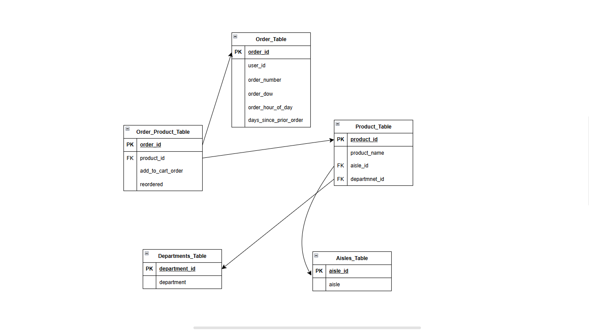

# Ecommerce Data Analysis 🛒📊

Project Overview
This project focuses on analyzing eCommerce order data using Python, PostgreSQL, and SQL. The dataset consists of five CSV files:

orders.csv 🛍️ – Contains order details (order ID, user ID, order time, etc.).
aisles.csv 🏬 – List of different aisles in the store.
departments.csv 🏢 – Department information for products.
order_products.csv 🛒 – Links products with orders, including reorder status.
products.csv 📦 – Details of all products available.
The main objective is to extract, transform, and analyze the data to gain insights into customer purchasing behavior.

Entity-Relationship (ER) Diagram
The following ER diagram illustrates how the tables in our PostgreSQL database are structured and connected:

Database Schema
📌 Relationships between tables:
✅ orders → order_products (one order can have multiple products).
✅ products → aisles & departments (each product belongs to one aisle & department).
✅ order_products → Links orders with products.

📷 ER Diagram:

Make sure to include the ER diagram image in your repository and reference it below.

# md

Tech Stack & Tools
Python 🐍 – Data processing & automation.
PostgreSQL 🗄️ – Relational database management.
pandas 📊 – Data manipulation & transformation.
psycopg2 🔌 – Connecting Python to PostgreSQL.
SQLAlchemy ⚙️ – Database connection and queries.
Matplotlib & Seaborn 📈 – Data visualization.
Jupyter Notebook 📖 – Running SQL queries and analysis.
Database Schema (DDL - SQL Table Creation)
Based on the ER diagram, below is the SQL schema definition:

## 

# sql
CREATE TABLE orders (
    order_id SERIAL PRIMARY KEY,
    user_id INT,
    order_number INT,
    order_dow INT,
    order_hour_of_day INT,
    days_since_prior_order INT
);

CREATE TABLE aisles (
    aisle_id SERIAL PRIMARY KEY,
    aisle VARCHAR(255)
);

CREATE TABLE departments (
    department_id SERIAL PRIMARY KEY,
    department VARCHAR(255)
);

CREATE TABLE products (
    product_id SERIAL PRIMARY KEY,
    product_name VARCHAR(255),
    aisle_id INT REFERENCES aisles(aisle_id) ON DELETE CASCADE,
    department_id INT REFERENCES departments(department_id) ON DELETE CASCADE
);

CREATE TABLE order_products (
    order_id INT REFERENCES orders(order_id) ON DELETE CASCADE,
    product_id INT REFERENCES products(product_id) ON DELETE CASCADE,
    add_to_cart_order INT,
    reordered INT,
    PRIMARY KEY (order_id, product_id)
);
Workflow
1️⃣ Extract CSV files using pandas.
2️⃣ Transform and clean data.
3️⃣ Load data into PostgreSQL database.
4️⃣ Analyze data using SQL queries.
5️⃣ Visualize insights using graphs and charts.

SQL Queries & Analysis
1️⃣ Orders with Product & Department Information

# sql
CREATE TEMP TABLE order_details AS
SELECT o.order_id, p.product_id, p.product_name, d.department_id, d.department, a.aisle_id, a.aisle
FROM orders o
JOIN order_products op ON o.order_id = op.order_id
JOIN products p ON op.product_id = p.product_id
JOIN aisles a ON p.aisle_id = a.aisle_id
JOIN departments d ON p.department_id = d.department_id;
2️⃣ Most Purchased & Reordered Products

# sql

CREATE TEMP TABLE product_summary AS
SELECT p.product_id, p.product_name,
       COUNT(op.order_id) AS total_purchases,
       SUM(op.reordered) AS total_reorders,
       AVG(op.add_to_cart_order) AS avg_add_to_cart
FROM order_products op
JOIN products p ON op.product_id = p.product_id
GROUP BY p.product_id, p.product_name;
3️⃣ Orders Grouped by Department

# SQL
CREATE TEMP TABLE department_summary AS
SELECT d.department_id, d.department,
       COUNT(op.product_id) AS total_products_purchased,
       COUNT(DISTINCT op.product_id) AS unique_products_purchased,
       SUM(CASE WHEN o.order_dow IN (0,6) THEN 1 ELSE 0 END) AS total_weekend_purchases,
       SUM(CASE WHEN o.order_dow BETWEEN 1 AND 5 THEN 1 ELSE 0 END) AS total_weekday_purchases,
       AVG(o.order_hour_of_day) AS avg_order_time
FROM orders o
JOIN order_products op ON o.order_id = op.order_id
JOIN products p ON op.product_id = p.product_id
JOIN departments d ON p.department_id = d.department_id
GROUP BY d.department_id, d.department;
Performance Optimizations 🚀
✅ Indexes on frequently used columns

# SQL

CREATE INDEX idx_order_id ON order_products(order_id);
CREATE INDEX idx_product_id ON products(product_id);
✅ Using TEMP TABLES for faster query execution
Temporary tables reduce redundant joins and improve performance.

✅ Batch Inserts for Efficient Data Loading

# python

for chunk in pd.read_csv("orders.csv", chunksize=10000):
    chunk.to_sql("orders", con=engine, if_exists="append", index=False)
✅ Optimized Joins using Indexed Columns

# sql

EXPLAIN ANALYZE 
SELECT * 
FROM orders o
JOIN order_products op ON o.order_id = op.order_id
JOIN products p ON op.product_id = p.product_id;
This helps analyze query performance and optimize it.

Data Visualization 📊
📌 Top 10 Most Purchased Products

# python

import matplotlib.pyplot as plt
import seaborn as sns

query = "SELECT product_name, total_purchases FROM product_summary ORDER BY total_purchases DESC LIMIT 10"
df = pd.read_sql(query, con=engine)

plt.figure(figsize=(12,6))
sns.barplot(x="total_purchases", y="product_name", data=df, palette="Blues_r")
plt.xlabel("Total Purchases")
plt.ylabel("Product Name")
plt.title("Top 10 Most Purchased Products")
plt.show()
📌 Weekday vs Weekend Purchases by Department

# python

query = "SELECT department, total_weekday_purchases, total_weekend_purchases FROM department_summary"
df = pd.read_sql(query, con=engine)

df.plot(kind="bar", x="department", stacked=True, figsize=(12,6))
plt.xlabel("Department")
plt.ylabel("Number of Purchases")
plt.title("Weekday vs Weekend Purchases by Department")
plt.show()

## How to Run the Project

# sh

git clone https://github.com/AnishThakur22/Ecommerce_Data_Analysis.git
cd Ecommerce_Data_Analysis
Install dependencies

# sh

pip install pandas psycopg2 sqlalchemy jupyter matplotlib seaborn
Load the SQL schema into your PostgreSQL database

Ensure your PostgreSQL server is running and accessible. Then, execute the SQL schema file to set up the database structure:

# sh

psql -U your_username -d your_database -f e_commerce_data_analysis.sql
Replace your_username and your_database with your PostgreSQL credentials.

Start Jupyter Notebook and run the analysis

# sh

jupyter notebook ecom_data_analysis.ipynb
This will open the Jupyter Notebook interface in your browser, allowing you to interact with the ecom_data_analysis.ipynb notebook.

Update database connection details

Before executing the notebook cells, ensure that the database connection parameters within the notebook match your PostgreSQL setup.

Conclusion
This project provides an end-to-end data analysis pipeline using Python and SQL, demonstrating how to clean, transform, and analyze large datasets to extract valuable business insights. 🚀

